# JewelryStore

A full-stack e-commerce web application for managing a jewelry store with separate interfaces for customers and store managers. Features include product browsing, shopping cart, order management, inventory tracking, and an AI-powered chatbot assistant.

## Features

### Customer Features
- Browse jewelry products with detailed information
- View product details including materials, gemstones, and pricing
- Shopping cart functionality
- User profile management
- Google OAuth authentication

### Manager Features
- Dashboard with analytics and reports
- Product management (CRUD operations)
- Employee management
- Customer management
- Supplier management
- Order management and tracking
- Import/inventory management
- Revenue and cost analytics

### Additional Features
- AI-powered chatbot assistant (Google Gemini integration)
- Image upload and management with Cloudinary
- JWT-based authentication
- Role-based access control
- RESTful API with Swagger

## Preview

### Customer Pages

#### Customer Home Page


#### Customer Product List
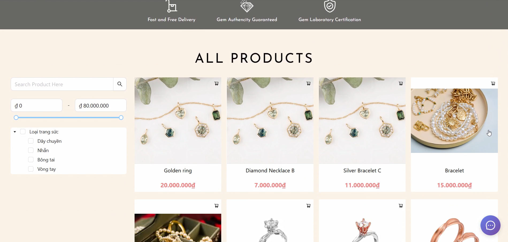

#### Customer Product Detail
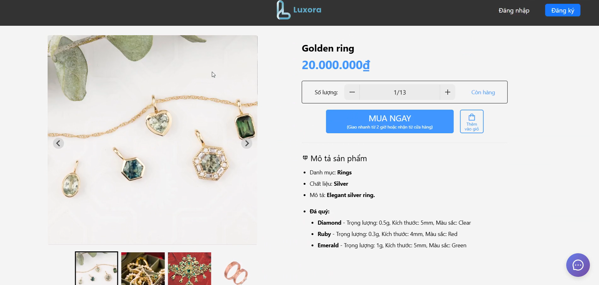

#### Customer Cart Page
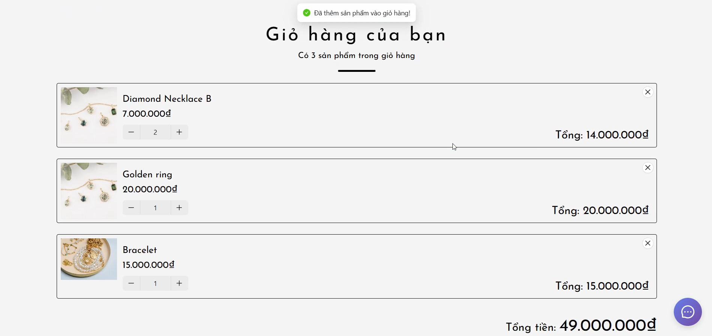

#### Customer Profile Page
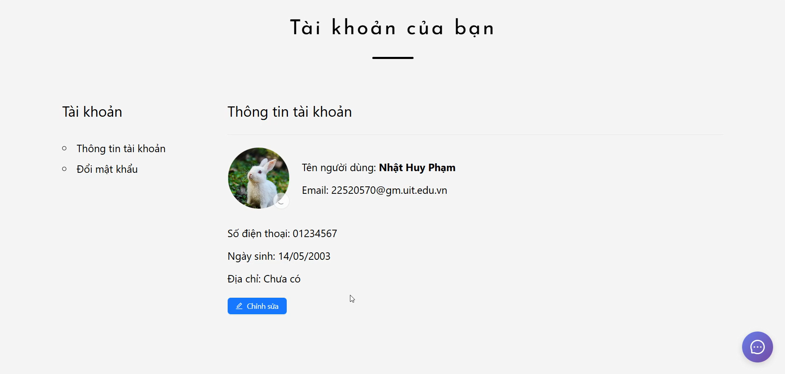

### Manager Pages

#### Manager Dashboard
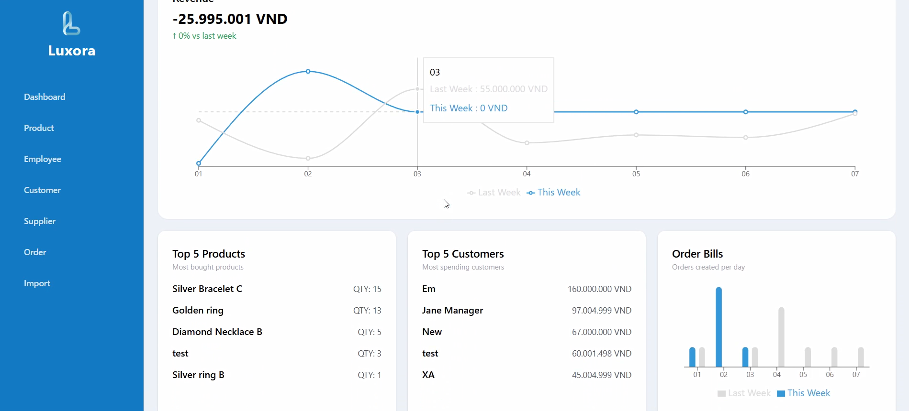

#### Manager Product List
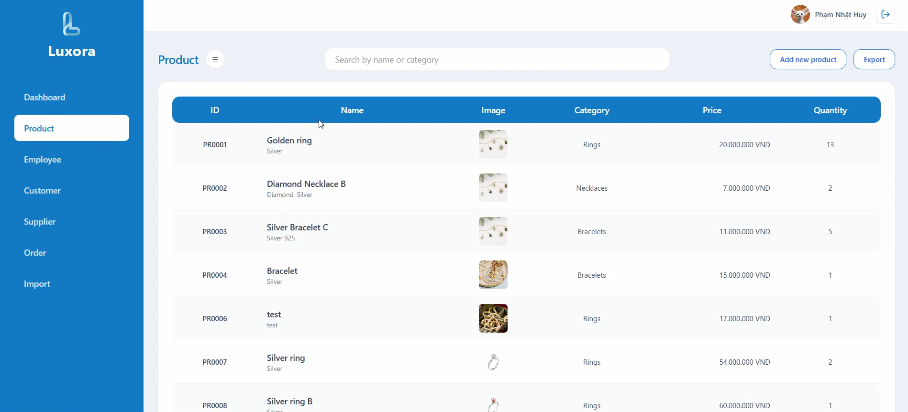

#### Manager Product Detail
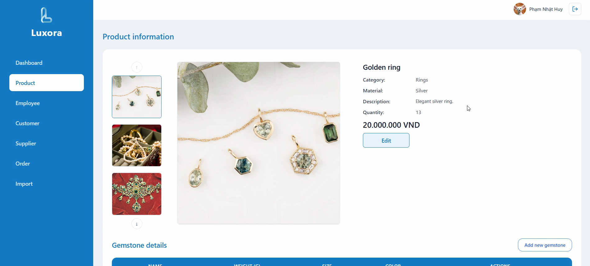

#### Manager Order Detail
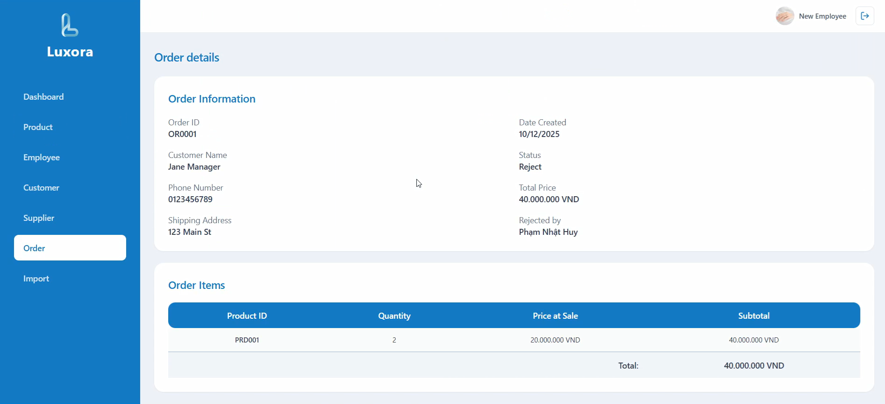

#### Manager Employee List
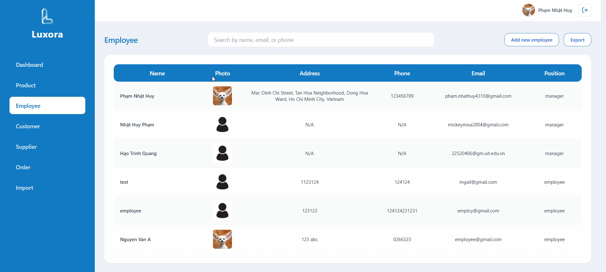

### Authentication & AI Features

#### Login with Google OAuth
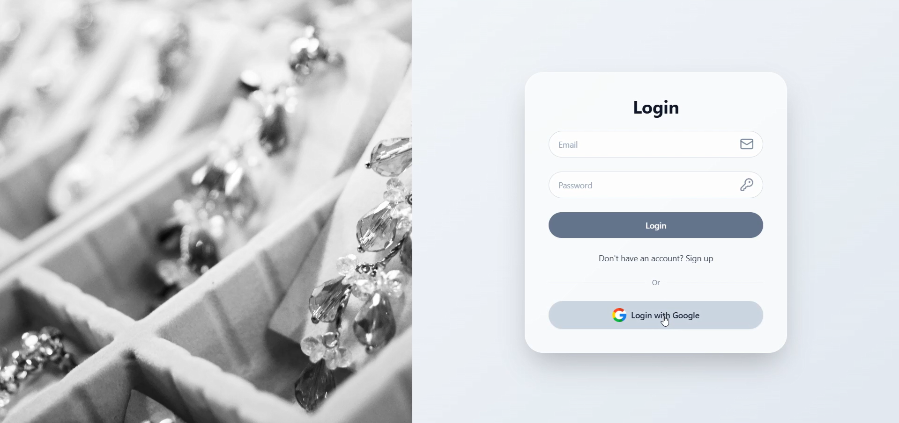

#### AI Chatbot Assistant
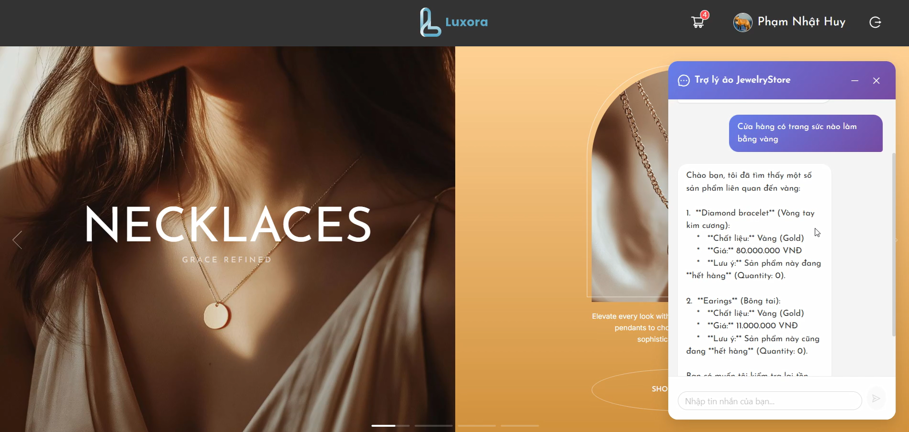

## Getting Started

### Prerequisites
- [.NET SDK](https://dotnet.microsoft.com/download)
- [Node.js](https://nodejs.org/en) 
- [npm](https://www.npmjs.com/) or [yarn](https://yarnpkg.com/)
- [PostgreSQL](https://www.postgresql.org/download/) (local or cloud instance)
- [Google Cloud Platform](https://cloud.google.com/) account (for OAuth and Gemini API)
- [Cloudinary](https://cloudinary.com/) account (for image management)

## Step 1: Clone the Repository

```bash
git clone https://github.com/RavenCrowls/ELearning
cd JewelryStore
```

## Step 2: Set Up the Backend (ASP.NET Core)

### 2.1 Navigate to the backend directory
```bash
cd JewelryStore
```

### 2.2 Restore dependencies
```bash
dotnet restore
```

### 2.3 Configure database connection
Update `appsettings.json` or `appsettings.Development.json` with your PostgreSQL connection string:
   ```json
   {
     "ConnectionStrings": {
       "DefaultConnection": "Host=localhost;Port=5432;Database=jewelrystore;Username=your_username;Password=your_password"
     }
   }
   ```
### 2.4 Configure application secrets
Set up user secrets for sensitive configuration:

```bash
dotnet user-secrets init
dotnet user-secrets set "Authentication:Google:ClientId" "your_google_client_id"
dotnet user-secrets set "Authentication:Google:ClientSecret" "your_google_client_secret"
dotnet user-secrets set "Gemini:ApiKey" "your_gemini_api_key"
dotnet user-secrets set "Cloudinary:CloudName" "your_cloudinary_cloud_name"
dotnet user-secrets set "Cloudinary:ApiKey" "your_cloudinary_api_key"
dotnet user-secrets set "Cloudinary:ApiSecret" "your_cloudinary_api_secret"
```

- Get Google OAuth credentials from [Google Cloud Console](https://console.cloud.google.com/)
- Get Gemini API key from [Google AI Studio](https://makersuite.google.com/app/apikey)
- Get Cloudinary credentials from your [Cloudinary Dashboard](https://cloudinary.com/console)

### 2.5 Run database migrations
```bash
dotnet ef database update
```

### 2.6 Start the backend server
```bash
dotnet run
```

## Step 3: Set Up the Frontend (React)

### 3.1 Navigate to the client directory
```bash
cd Client
```

### 3.2 Install dependencies
```bash
npm install
```

### 3.3 Configure environment variables
Create a `.env` file in the `Client` directory:
   ```env
   VITE_API_BASE_URL=http://localhost:5000/api
   ```
- Make sure the port matches your backend server port

### 3.4 Start the development server
```bash
npm run dev
```

## Step 4: Database Setup

### Option A: Local PostgreSQL
1. Install and start PostgreSQL service
2. Create a database named `jewelrystore` (or your preferred name)
3. Update the connection string in `appsettings.json` or `appsettings.Development.json`

### Option B: Cloud PostgreSQL
1. Create a PostgreSQL instance on your preferred cloud provider (Azure, AWS Supabase, etc.)
2. Get the connection string from your cloud provider
3. Update the connection string in your configuration files

### Initial Data
The application includes seed data that will be automatically populated on first run:
- Default admin user
- Sample products and categories
- Sample orders and customers
- Sample suppliers and imports

## Step 5: Verify the Setup

1. **Backend**: Visit `https://localhost:5001/swagger` - you should see the Swagger API documentation
2. **Frontend**: Visit `http://localhost:5173` - you should see the JewelryStore application
3. **Test Authentication**: Try logging in with Google OAuth or creating a new account

## Project Structure

```
JewelryStore/
├── Client/                     
│   ├── src/
│   │   ├── components/        
│   │   ├── pages/              
│   │   │   ├── customer/       
│   │   │   └── manager/        
│   │   ├── layouts/            
│   │   ├── router/             
│   │   ├── services/           
│   │   ├── hooks/              
│   │   ├── types/              
│   │   └── utils/              
│   ├── public/                 
│   └── package.json
└── JewelryStore/               
    ├── Controllers/            
    ├── Models/                 
    ├── Services/               
    ├── Data/                   
    │   ├── Configurations/     
    │   └── Seed/               
    ├── Plugins/                
    ├── Options/                
    ├── Migrations/             
    └── Program.cs                                 
```

## Technologies Used

### Backend
- [ASP.NET Core](https://dotnet.microsoft.com/apps/aspnet) (8.0) - Web framework
- [Entity Framework Core](https://learn.microsoft.com/en-us/ef/core/) - ORM
- [PostgreSQL](https://www.postgresql.org/) - Database ([Supabase](https://supabase.com/) - Cloud Database)
- [Supabase](https://supabase.com/) - Cloud PostgreSQL database hosting
- [ASP.NET Core Identity](https://learn.microsoft.com/en-us/aspnet/core/security/authentication/identity) - Authentication and authorization
- [Microsoft Semantic Kernel](https://learn.microsoft.com/en-us/semantic-kernel/) - AI integration
- [Google Gemini](https://ai.google.dev/) - AI chatbot
- [Cloudinary](https://cloudinary.com/) - Image management
- [Swagger](https://swagger.io/) - API documentation

### Frontend
- [React](https://react.dev/) (19.1.1) - UI library
- [TypeScript](https://www.typescriptlang.org/) - Type-safe JavaScript
- [Vite](https://vitejs.dev/) - Build tool and dev server
- [React Router](https://reactrouter.com/) - Routing
- [Tailwind CSS](https://tailwindcss.com/) - Utility-first CSS framework
- [Ant Design](https://ant.design/) - UI component library
- [Axios](https://axios-http.com/) - HTTP client
- [Recharts](https://recharts.org/) - Chart library
- [Lucide React](https://lucide.dev/) - Icon library
